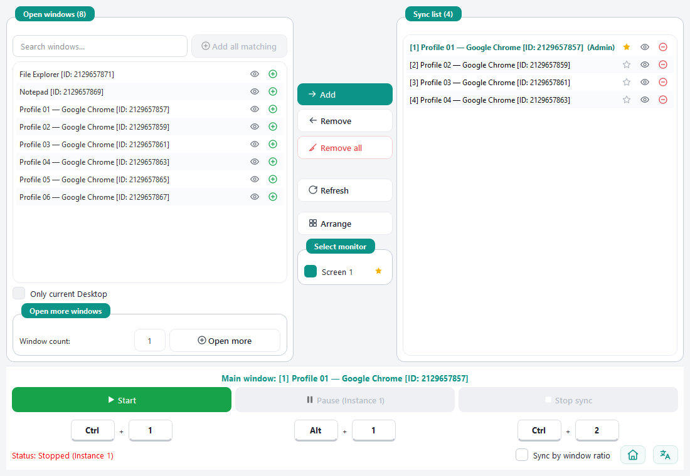

<h1 align="center">Mouse Synchronization</h1>

<b>Управляйте множеством окон одновременно одной мышью — щёлкайте, прокручивайте и перетаскивайте в одном ведущем окне, и все остальные окна из списка в тот же момент делают ровно то же самое.</b>

  <a href="README.md">English</a> ·
  <a href="README.vi.md">Tiếng Việt</a> ·
  <a href="README.bn.md">বাংলা</a> ·
  <a href="README.hi.md">हिन्दी</a> ·
  <a href="README.pt_BR.md">Português (BR)</a> ·
  <b>Русский</b> ·
  <a href="README.tr.md">Türkçe</a> ·
  <a href="README.ur.md">اردو</a> ·
  <a href="README.zh_CN.md">简体中文</a>

  

---

## Установка

### Шаг 1 — Скачайте

Скачайте последнюю сборку со страницы **[Releases](https://github.com/duckmartians/Mouse-Synchronization/releases/latest)**:

| Ваш компьютер | Скачать | Примечание |
|---|---|---|
| 🪟 **Windows** | [Windows (.zip)](https://github.com/duckmartians/Mouse-Synchronization/releases/latest) | Файл называется [`Mouse-Synchronization_v<версия>.zip`](https://github.com/duckmartians/Mouse-Synchronization/releases/latest). Версии для macOS нет. |

### Шаг 2 — Распакуйте и запустите

<b>🪟 В Windows</b>

1. **Распакуйте** скачанный `.zip` в любую папку (правый щелчок → **Извлечь все…**). Установщика нет.
2. Откройте распакованную папку и запустите **`Mouse Synchronization.exe`**.
3. Если появится окно **«Система Windows защитила ваш компьютер»** (SmartScreen): нажмите **Подробнее** → **Выполнить в любом случае**. *(Приложение не подписано сертификатом Microsoft, поэтому может помечаться — это не вирус.)*
4. Держите всю папку целиком — `.exe` нужны файлы рядом с ним. Чтобы удалить приложение, просто удалите папку.

### Шаг 3 — Бесплатно, без аккаунта

Mouse Synchronization **бесплатна**: без аккаунта, без ключа активации, без рекламы. Для обычных окон права администратора не нужны (про окна, запущенные от имени администратора, см. раздел «Решение проблем» ниже).

---

## Первый запуск

1. **Откройте окна, которыми хотите управлять** — например, несколько копий одной программы.
2. **Запустите Mouse Synchronization.** Левая панель, **Открытые окна**, показывает всё, что сейчас открыто.
3. **Добавьте их в список синхронизации.** Нажмите зелёный **➕** рядом с окном (или выделите несколько и нажмите **Добавить →**). Они переместятся в правую панель, **Список синхронизации**. Нужно **минимум 2 окна**.
4. **Выберите ведущее окно.** В списке синхронизации нажмите **звёздочку ☆** рядом с окном, из которого будете управлять. Она станет **золотой ★** — это ваше главное окно.
5. **Нажмите Старт** (или **Ctrl + 1**).
6. **Работайте в ведущем окне.** Щёлкайте, прокручивайте или перетаскивайте внутри него — все остальные окна из списка делают то же самое в тот же момент.

Чтобы остановить, нажмите **Остановить синхронизацию** (или **Ctrl + 2**). Чтобы сделать короткую паузу без остановки, нажмите **Пауза** (**Alt + 1**).

---

## Возможности

- **Одна мышь — много окон** — левый, правый и средний щелчки, прокрутка и перетаскивание в ведущем окне одновременно отправляются во все окна из списка синхронизации. Синхронизируется только мышь, не клавиатура.
- **Синхронизация по пропорциям окна** — если окна разного размера или в разных местах, действия сопоставляются по *относительному* положению, а не по точным координатам.
- **Быстрый поиск и добавление окон** — живой список окон с поиском, кнопкой **Добавить совпадения** для целой группы сразу и фильтром по текущему виртуальному рабочему столу.
- **Расстановка сеткой** — выстраивает синхронизируемые окна ровной сеткой на выбранных мониторах.
- **Открыть больше окон** — запускает от 1 до 20 дополнительных копий программы, которой принадлежит окно.
- **Настраиваемые горячие клавиши** — Старт, Стоп и Пауза / Продолжить, запоминаются между сеансами.
- **Плавающий значок статуса** — зелёный во время синхронизации, янтарный на паузе; щёлкните по нему, чтобы поставить на паузу или продолжить.
- **Несколько копий утилиты** — у каждой копии свой номер и своя клавиша паузы.
- **9 языков** — переключаются мгновенно кнопкой 🌐, без перезапуска.

---

## Главное окно

### 🪟 Левая панель — Открытые окна

Живой список всех открытых окон на компьютере.
- **➕** — добавить это окно в список синхронизации.
- **👁** — вывести это окно на передний план.
- **Поле поиска** — введите часть названия окна, чтобы отфильтровать список.
- **Добавить совпадения** — одним щелчком добавляет все окна, подходящие под поиск (работает после того, как вы что-то ввели в поле поиска). Удобно, когда нужно добавить 10+ окон.
- **Только текущий рабочий стол** — скрывает окна с других виртуальных рабочих столов.

### ➕ Открыть больше окон

Нужно больше копий программы? Выберите окно в списке **Открытые окна**, задайте **Число окон** (1–20) и нажмите **Открыть ещё**. Приложение найдёт программу, которой принадлежит окно, и запустит дополнительные копии. Некоторые программы разрешают только одну свою копию — они сами закроют лишние; это правило программы, а не ошибка.

### ↔️ Средняя колонка — действия

- **Добавить → / ← Удалить / Удалить все** — переносят окна в список синхронизации и обратно.
- **Обновить** — заново ищет открытые окна (если какого-то окна не хватает).
- **Упорядочить** — выстраивает синхронизируемые окна ровной сеткой на мониторах, отмеченных в **Выбор монитора**.
- **Выбор монитора** — отметьте экраны, на которых расставлять окна. **Звёздочка** отмечает ваш «главный» экран; это лишь метка внутри приложения, настройки Windows она **не** меняет.

### ⭐ Правая панель — Список синхронизации

Окна, которые будут повторять за ведущим.
- **Звёздочка ★** — выбрать ведущее (главное) окно. Ведущим может быть только одно окно.
- **👁** — вывести окно на передний план.
- **➖** — убрать окно из списка.

Пока окно находится в списке синхронизации, приложение добавляет к его заголовку небольшой номер вроде `[1]`, `[2]`, чтобы окна было легко различать. Исходные заголовки возвращаются, когда вы убираете окно из списка или закрываете приложение.

### ▶️ Нижняя панель — управление

- **Старт / Пауза / Остановить синхронизацию** — запуск, пауза или остановка синхронизации. Маленькие поля под каждой кнопкой — её горячая клавиша.
- **Синхронизация по пропорциям окна** — **включите**, если окна разного размера или в разных местах; оставьте **выключенной**, если все они одного размера и выровнены.
- **🏠** — открывает сайт Duck Martians ([duckmartians.info](https://duckmartians.info)).
- **🌐** — смена языка приложения (English, Tiếng Việt, বাংলা, हिन्दी, Português (Brasil), Русский, Türkçe, اردو, 简体中文).

---

## Горячие клавиши

| Действие | По умолчанию |
|---|---|
| Старт | **Ctrl + 1** |
| Стоп | **Ctrl + 2** |
| Пауза / Продолжить | **Alt + 1** |

**Как изменить:** щёлкните по полю горячей клавиши, введите нужные клавиши (например `Ctrl` в первом поле и `F5` во втором) и щёлкните в другом месте. Поля горячих клавиш **заблокированы во время синхронизации** — сначала остановите её. Горячие клавиши запоминаются до следующего запуска приложения.

## Плавающий значок статуса

Когда синхронизация начинается, в углу экрана появляется небольшой значок: **зелёный** — идёт синхронизация, **янтарный** — пауза. **Щёлкните по значку**, чтобы поставить на паузу или продолжить, — удобно, когда приложение закрыто другими окнами. Значок исчезает после нажатия «Стоп».

## Несколько копий утилиты

Mouse Synchronization можно открыть несколько раз. Каждая копия получает свой номер («Экземпляр 1», «Экземпляр 2»…), который виден в заголовке и на кнопке «Пауза», и свою клавишу паузы по умолчанию (**Alt + её номер**), так что ставить копии на паузу можно независимо.

---

## Где хранятся данные

| Что | Где |
|---|---|
| Язык и горячие клавиши | `%APPDATA%\Mouse Synchronization\settings.ini` |

Больше ничего не сохраняется, и приложение никуда ничего не отправляет — действия мыши передаются напрямую окнам на вашем компьютере.

---

## Решение проблем

**Старт ничего не делает / показывает предупреждение** — выберите главное окно (золотая звёздочка ★) и добавьте в список синхронизации минимум 2 окна.

**Нужного окна нет в списке** — нажмите **Обновить**. Если окно на другом виртуальном рабочем столе, снимите флажок **Только текущий рабочий стол**.

**Остальные окна не реагируют на щелчки** — действовать нужно внутри ведущего окна (золотая звёздочка) при запущенной синхронизации (зелёный значок). Если целевое окно запущено «от имени администратора», Windows не даёт обычным приложениям управлять им — правый щелчок по Mouse Synchronization → **Запуск от имени администратора**.

**Окна расположены не так, как ожидалось** — если они разного размера, включите **Синхронизация по пропорциям окна**. Чтобы выстроить их сеткой, отметьте мониторы в **Выбор монитора** и нажмите **Упорядочить**.

**«Открыть ещё» открывает копию, которая сразу закрывается** — эта программа разрешает только одну свою копию.

**Windows блокирует запуск окном «Система Windows защитила ваш компьютер»** — нажмите **Подробнее → Выполнить в любом случае**. Приложение не подписано сертификатом Microsoft — это не вирус.
